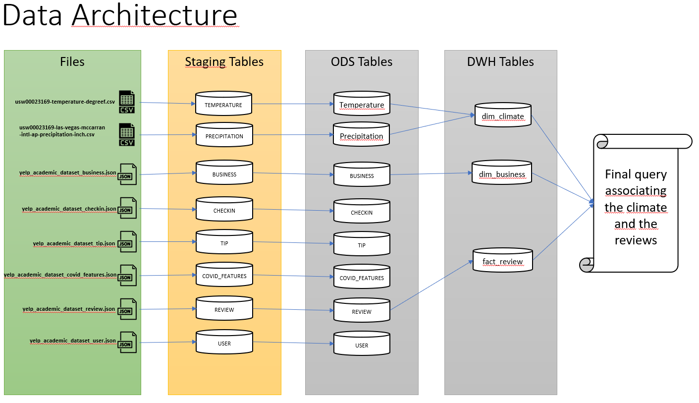
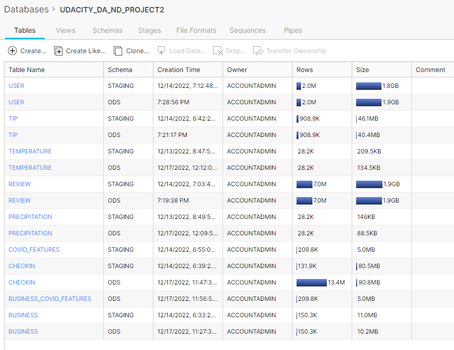
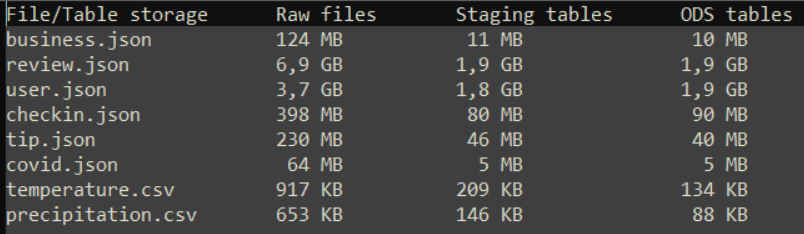
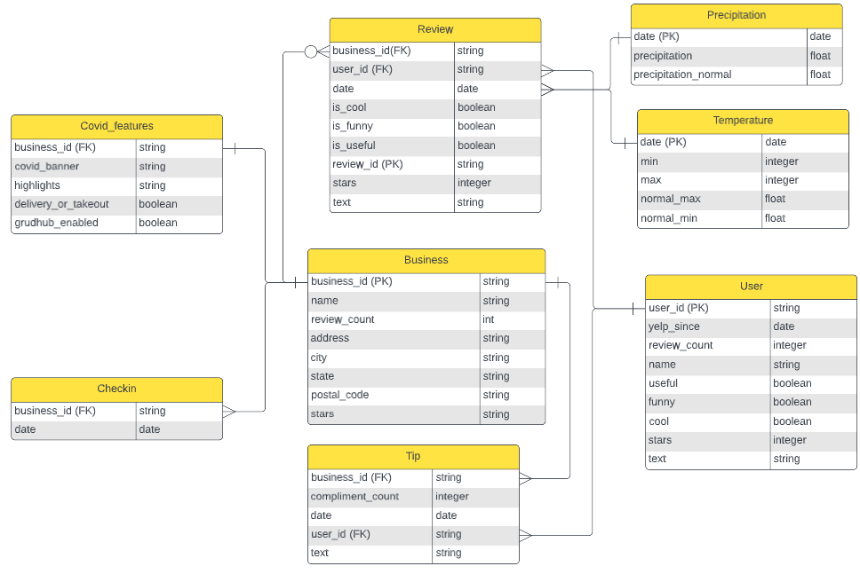
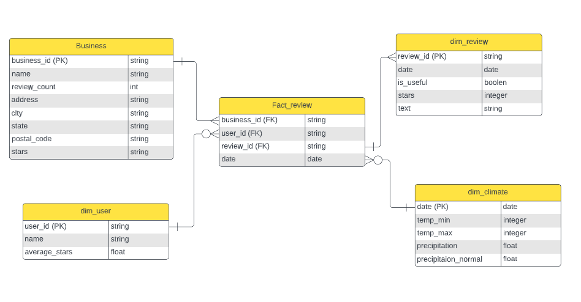
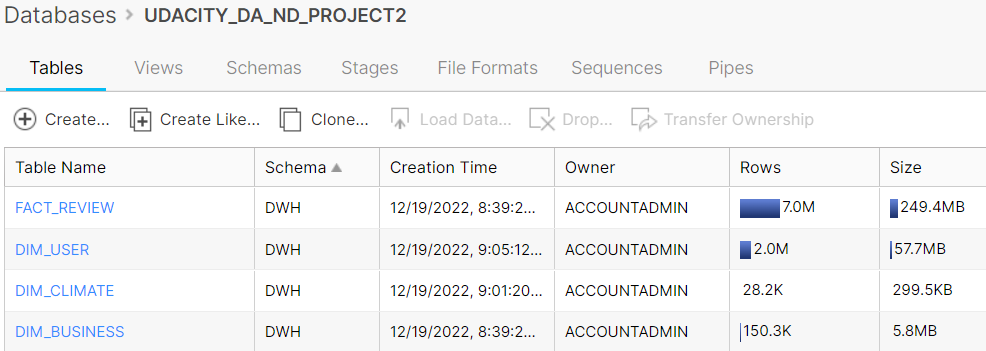
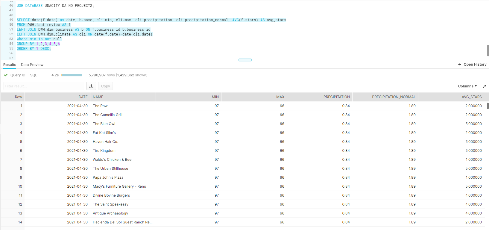

# Project 2 -  Design a Data Warehouse for Reporting and OLAP

## Data Architecture

## 8 Tables created in Staging
### 6 tables from YELP data + 2 tables from climate data

## SQL queries code that transforms staging to ODS can be found on [script_staging_to_ods.sql](script_staging_to_ods.sql)

## Files and Tables size 

## ER Model

## DWH Start schema

As the fact table only contains the FKs and the rating I prefer to keep on the fact_review instead of bring a dim_review

## DW Tables 

## Report query to associate climate and review
